# Before / after navigation comparisons

Original PNG pixels were encoded losslessly to WebP; no crop, resize, recolor or annotation. Source PNG hashes and decoded RGBA equality are in [the image manifest](screenshots/lossless-image-verification.json). Baseline nav1.3.0 and final candidate nav1.4.1; exact commits and full open/tablet/fallback matrix are in [REPORT.md](REPORT.md).

## Leveling · light

| Before 1.3.0 | After 1.4.1 |
| --- | --- |
| 390px  | 390px 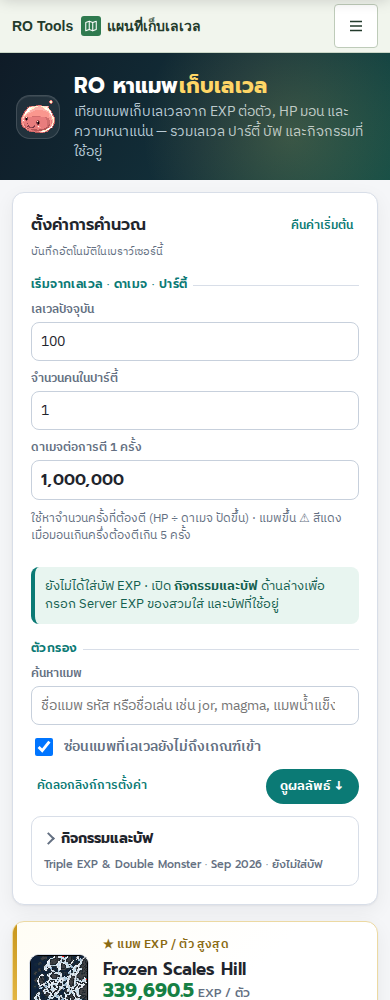 |
| 1440px 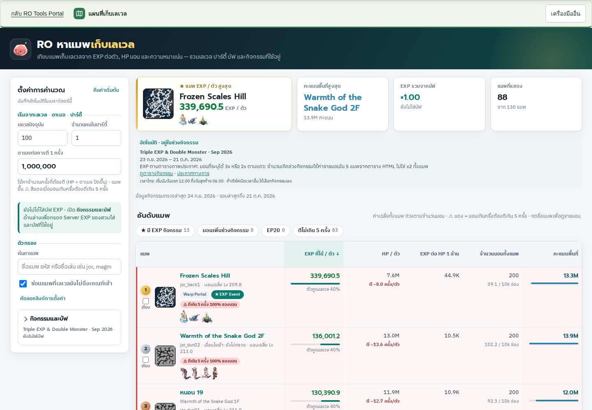 | 1440px 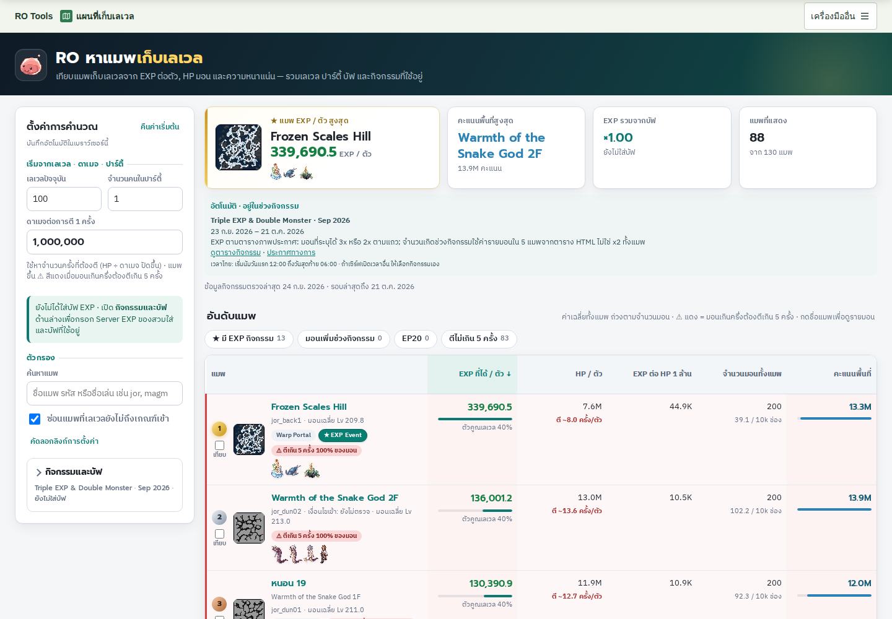 |

## Leveling · dark

| Before 1.3.0 | After 1.4.1 |
| --- | --- |
| 390px  | 390px 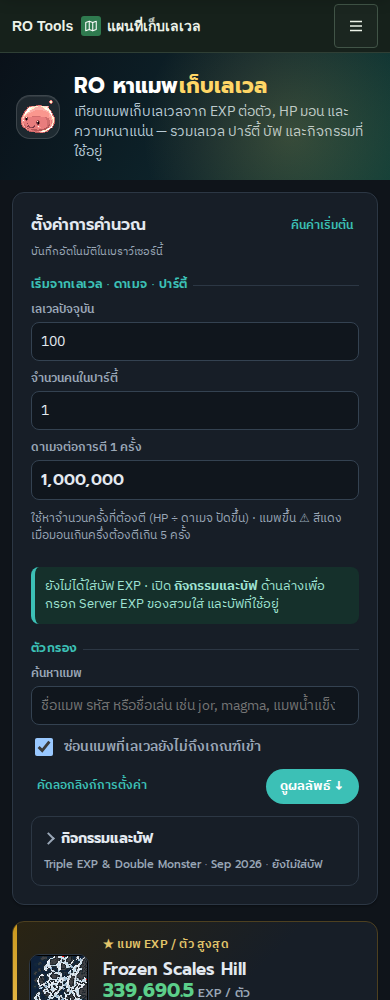 |
| 1440px 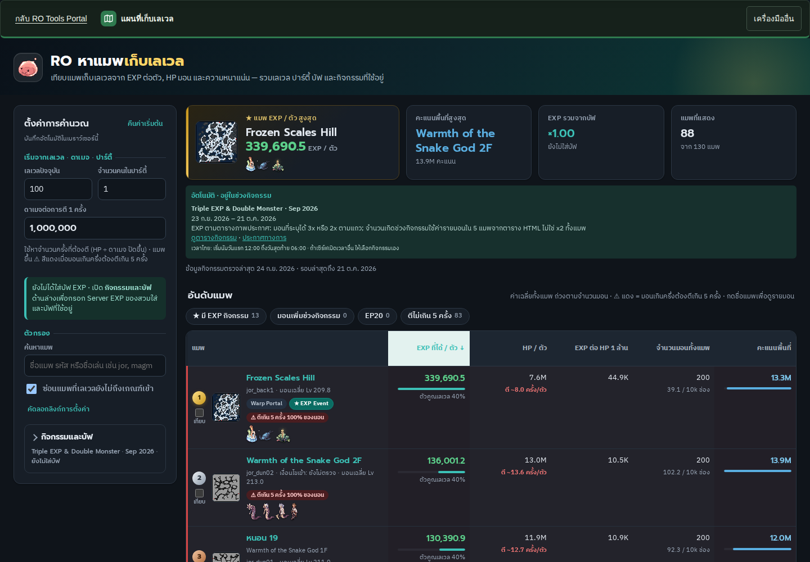 | 1440px 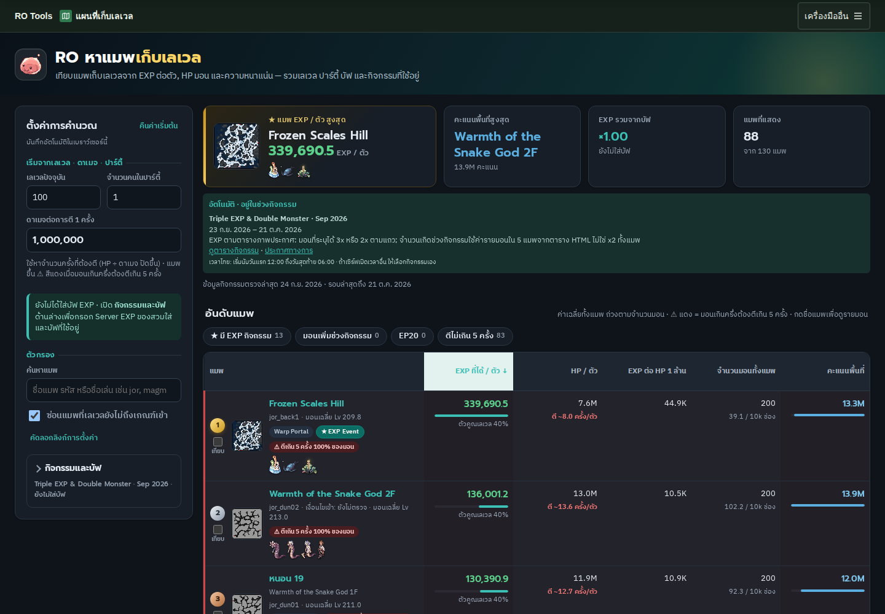 |

## Reform · light

| Before 1.3.0 | After 1.4.1 |
| --- | --- |
| 390px  | 390px  |
| 1440px  | 1440px  |

## Reform · dark

| Before 1.3.0 | After 1.4.1 |
| --- | --- |
| 390px  | 390px  |
| 1440px  | 1440px  |

## Dim Glacier · light

| Before 1.3.0 | After 1.4.1 |
| --- | --- |
| 390px 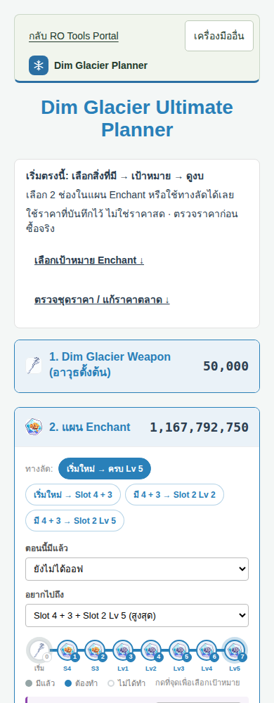 | 390px 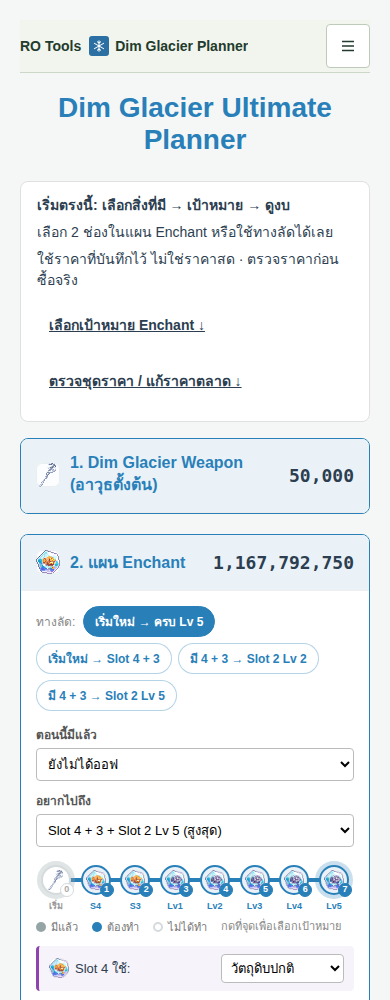 |
| 1440px 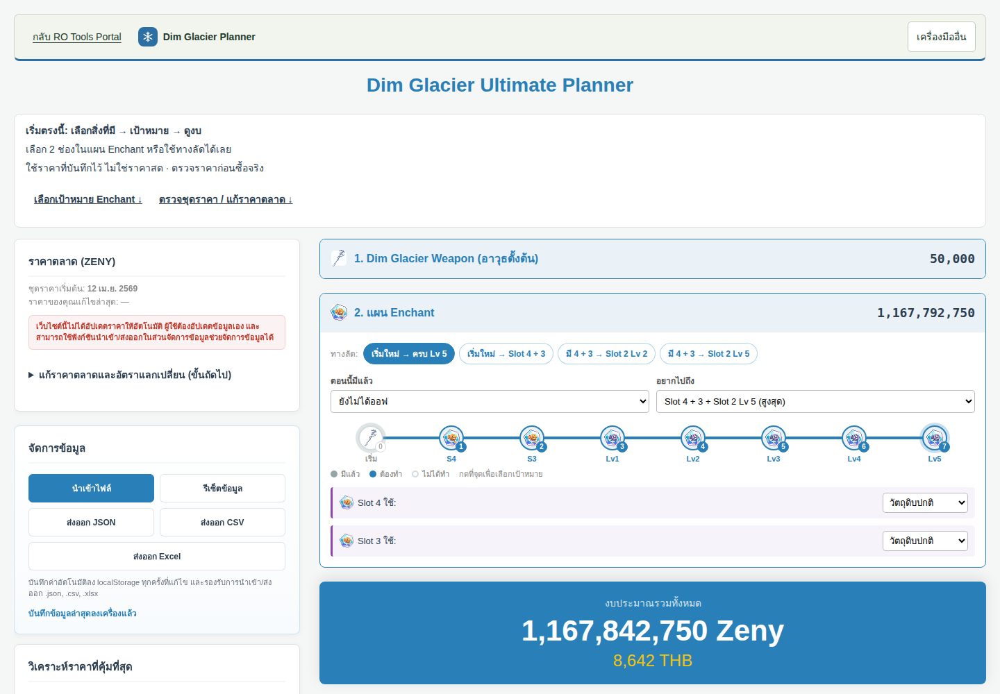 | 1440px 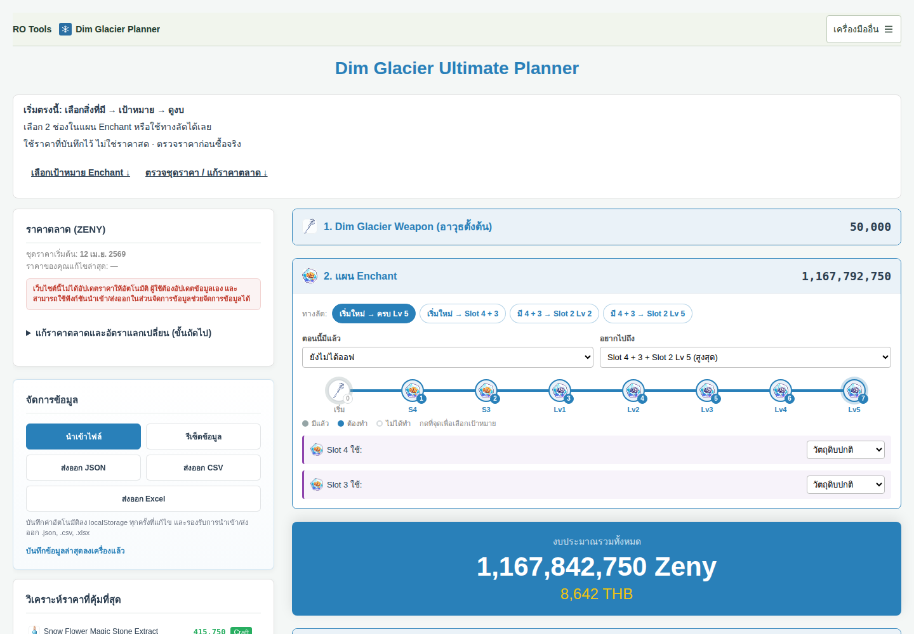 |

## Best Status · dark

| Before 1.3.0 | After 1.4.1 |
| --- | --- |
| 390px 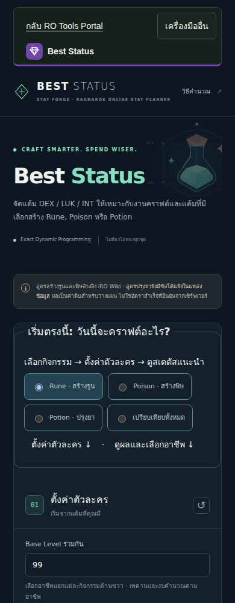 | 390px  |
| 1440px 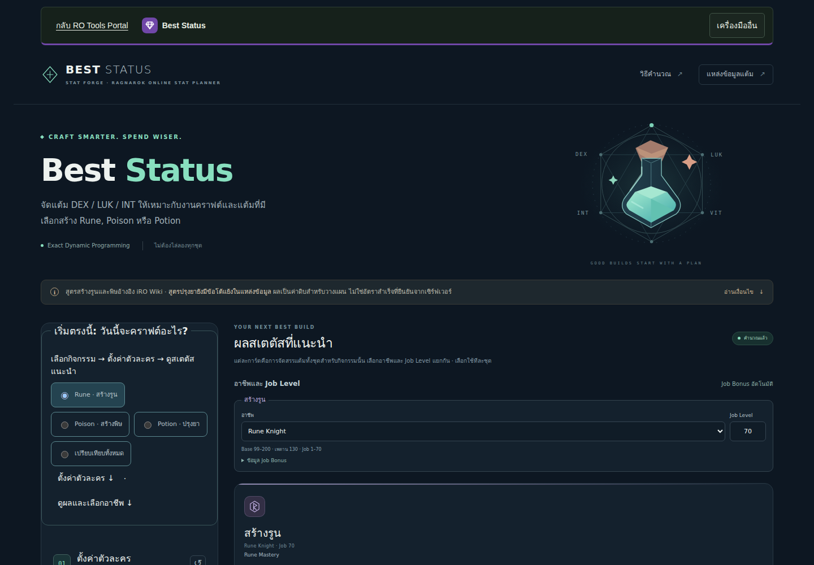 | 1440px 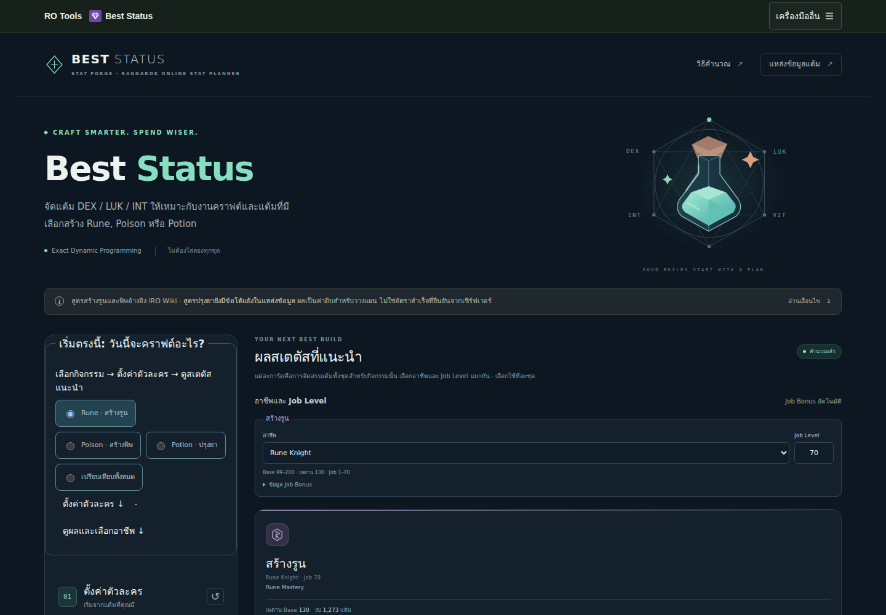 |

## Ocean Week · light

| Before 1.3.0 | After 1.4.1 |
| --- | --- |
| 390px 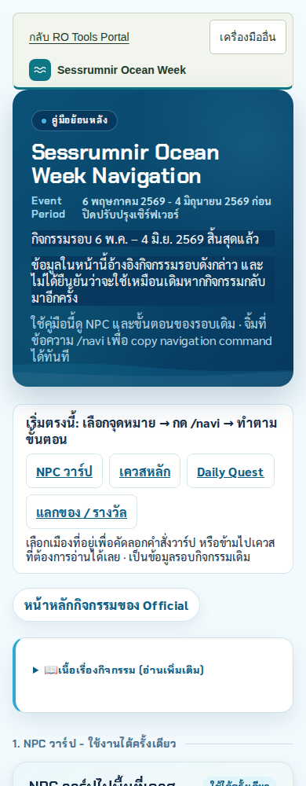 | 390px 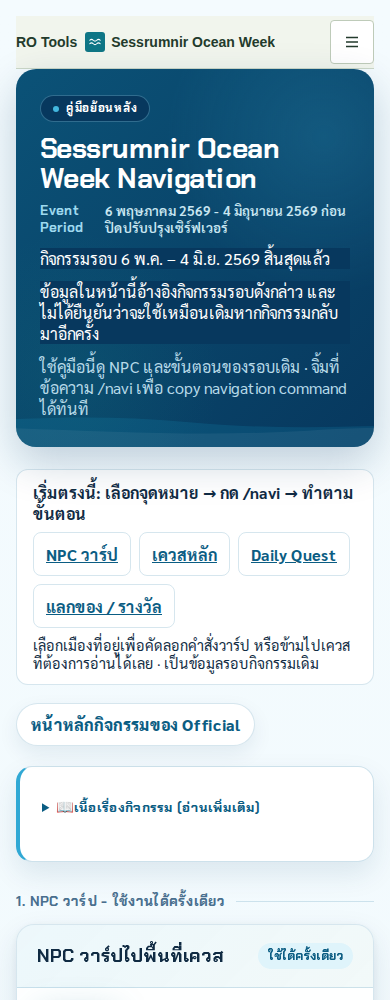 |
| 1440px 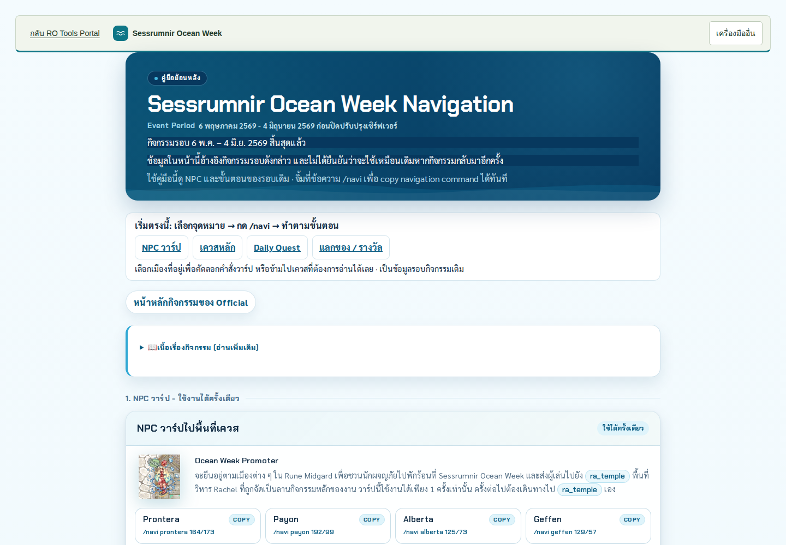 | 1440px 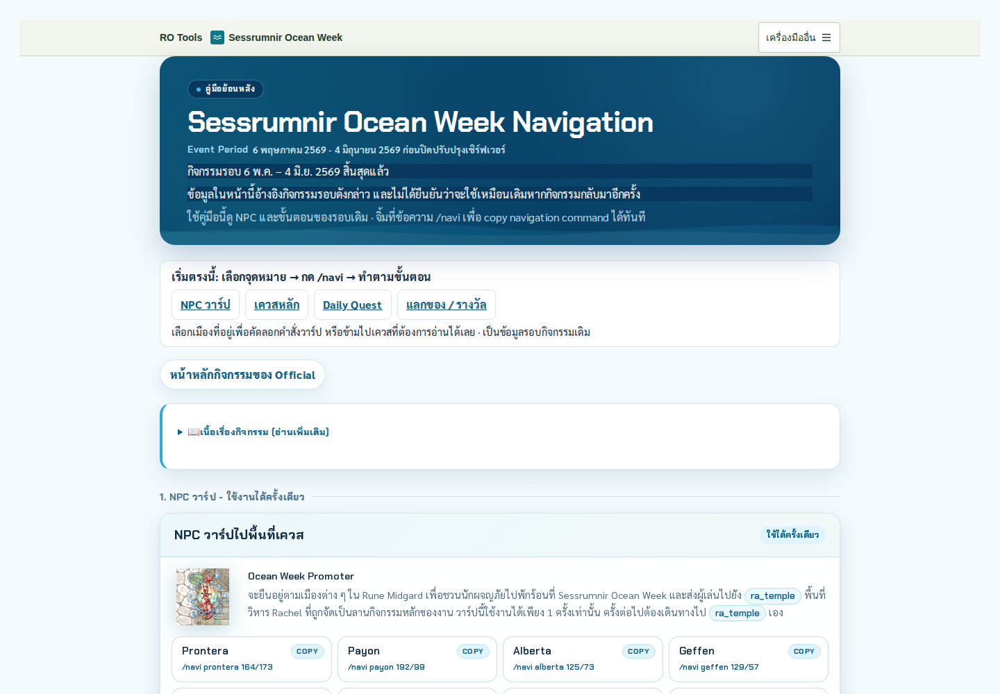 |

